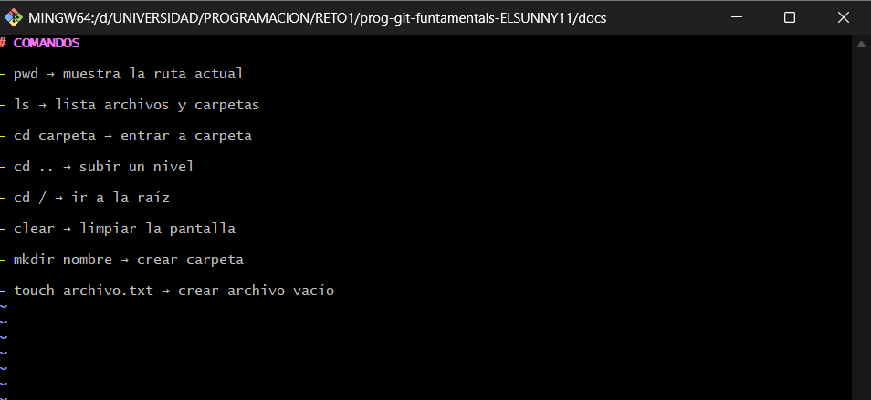

# COMANDOS

- pwd → muestra la ruta actual

- ls → lista archivos y carpetas

- cd carpeta → entrar a carpeta

- cd .. → subir un nivel

- cd / → ir a la raíz

- clear → limpiar la pantalla

- mkdir nombre → crear carpeta

- touch archivo.txt → crear archivo vacío

